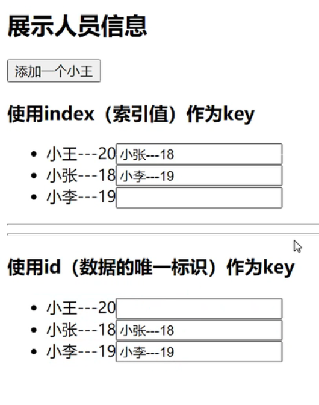

> **基于16.8版本，扩展新特性**

[react 中文文档](https://react.docschina.org/)   
[react 英文文档](https://reactjs.org/)

----

## **课程 - 032**
### 事件处理
### 事件委托 -- 事件冒泡
```js
class Demo extends React.Component{
/*
    1. 通过onXxx属性指定事件处理函数（注意大小写）
        a. React使用的是自定义（合成）事件，而不是使用的原生DOM事件 ———— 为了更好的兼容性
        b. React中的事件是通过【事件委托】方式处理的（委托给组件最外层的元素）———— 为了更高效
    2. 通过event.target得到发生事件的DOM元素对象
*/
// 创建ref容器
showData2 = (event) => {
    alert(event.target.value);
}
render() {
    return (
        <div>`                                                   
            <input onBlur={this.showData2} type="text" placeholder="失去焦点提示数据" />
        </div>
    )
}
}
```

----

## **课程 - 033**
### 收集表单数据
+ 非受控组件：代码见：[1_非受控组件.html](../react_basic/10_react中收集表单数据/1_非受控组件.html)

----

## **课程 - 034**
### 收集表单数据
+ 受控组件：可输入的dom随着输入，值就进入state中维护，就是受控组件 <br/>
代码见：[2_受控组件.html](../react_basic/10_react中收集表单数据/2_受控组件.html)
+ 双向数据绑定(VUE中的概念)：react通过onChange事件实现双向数据绑定的效果
> 推荐使用受控组件，优势在于可以省略ref。

----

## **课程 - 035**
### 高阶函数_函数柯里化
```js
//#region
    /*
        高阶函数：如果一个函数符合下面2个规范中的任何一个，那该函数就是高阶函数
            1.若A函数，接收的参数是一个函数，那么A就可以称之为高阶函数。
            2.若A函数，调用的返回值依然是一个函数，那么A就可以称之为高阶函数。
        常见的高阶函数有：Promise、serTimeout、arr.map()等。。。

        函数柯里化：
            通过函数调用继续返回函数的方式，实现多次接收参数最后统一处理的函数编码形式。
    */
//#endregion
```
代码见：[1_高阶函数_函数柯里化.html](../react_basic/11_高阶函数_函数柯里化/1_高阶函数_函数柯里化.html)
### 对象相关复习
代码见：[4_对象相关的知识.html](../react_basic/复习/4_对象相关的知识.html)

----

## **课程 - 036**
不用函数柯里化实现：代码见：[2_不用函数柯里化的实现.html](../react_basic/11_高阶函数_函数柯里化/2_不用函数柯里化的实现.html)

----

## **课程 - 037**
### 引出生命周期
代码见：[1_引出生命周期.html](../react_basic/12_组件的生命周期/1_引出生命周期.html)

----

## **课程 - 038**
### 生命周期(旧) —— 组件挂载流程
+ 执行顺序:
    constructor --> componentWillMount --> render --> componentDidMount
+ 代码见：[2_react生命周期(旧).html](../react_basic/12_组件的生命周期/2_react生命周期(旧).html)

----

## **课程 - 039**
### 生命周期(旧) —— setState流程
+ 执行顺序：
    shouldComponentUpdate --> componentWillUpdate --> render --> componentDidUpdate
+ 代码见：[2_react生命周期(旧).html](../react_basic/12_组件的生命周期/2_react生命周期(旧).html)

----

## **课程 - 040**
### 生命周期(旧) —— forceUpdate流程
+ forceUpdate使用场景：
    不想对状态进行更新，只想重新加载render
+ 执行顺序：
    shouldComponentUpdate --> componentWillUpdate --> render --> componentDidUpdate
+ 代码见[2_react生命周期(旧).html](../react_basic/12_组件的生命周期/2_react生命周期(旧).html)

----

## **课程 - 041**
### 生命周期(旧) —— 父组件render流程
componentWillReceiveProps: 这个生命周期有个问题，不接收第一次的props
+ 执行顺序：
    componentWillReceiveProps --> shouldComponentUpdate --> componentWillUpdate --> render --> componentDidUpdate
+ 代码见：[2_react生命周期(旧).html](../react_basic/12_组件的生命周期/2_react生命周期(旧).html)

----

## **课程 - 042**
### 总结生命周期(旧)
1. 初始化阶段：由ReactDOM.render()触发 --- 初次渲染
    1. constructor()
    2. componentWillMount()
    3. render()
    4. componentDidMount() ---- 【常用】
        - 一般在这个钩子中做一些初始化的事，例如：开启定时器、发送网络请求、订阅消息
2. 更新阶段：由组件内部的this.setState()或父组件render触发
    1. shouldComponentUpdate()
        - 返回值为true，调用render，更新视图
        - 返回值为false，不更新视图
    2. componentWillUpdate()
    3. render() ---- 【常用】
    4. componentDidUpdate()
3. 卸载组件：由ReactDOM.unmountComponentAtNode()触发
    1. componentWillUnmount()  ---- 【常用】
        - 一般在这个钩子中做一些收尾的事，例如：关闭定时器、取消订阅消息

+ 挂载流程图见：.png)
----

## **课程 - 043**
> **基于17.0.2版本**
> 下载库的网站：[BootCDN](https://www.bootcdn.cn/)
### 对比新旧生命周期
新生命周期中，废弃了3个旧生命周期:
+ componentWillMount
+ componeentWillUpdate
+ componentWillReceiveProps
新增了两个生命周期: 使用场景不多
+ getDerivedStateFromProps
+ getSnapshotBeforeUpdate

----

## **课程 - 044**
> **基于17.0.2版本**
### getDerivedStateFromProps
```js
//若state的值在任何时候都取决于props,那么可以使用getDerivedStateFromProps
            static getDerivedStateFromProps(props) {
                console.log('Count --- getDerivedStateFromProps', props);
                return props
            }
```

----

## **课程 - 045**
> **基于17.0.2版本**
### getSnapshotBeforeUpdate

----

## **课程 - 046**
> **基于17.0.2版本**
### getSnapshotBeforeUpdate的使用场景
理解：getSnapshotBeforeUpdate() 在最近一次渲染输出（提交到 DOM 节点）之前调用。
    它使得组件能在发生更改之前从 DOM 中捕获一些信息（例如，滚动位置）。
    此生命周期方法的任何返回值将作为参数传递给 componentDidUpdate()。
    此用法并不常见，但它可能出现在 UI 处理中，如需要以特殊方式处理滚动位置的聊天线程等。
    应返回 snapshot 的值（或 null）。
案例见：[4_getSnapshotBeforeUpdate的使用场景.html](../react_basic/12_组件的生命周期/4_getSnapshotBeforeUpdate的使用场景.html)

----

## **课程 - 047**
> **基于17.0.2版本**
### 总结生命周期(新)
1. 重要的钩子
    + render: 初始化渲染或更新渲染调用
    + componentDidMount: 开启监听，发送ajax请求
    + componentWillUnmount: 做一些收尾工作，如：清理定时器
2. 即将废弃的钩子：
    + componentWillMount
    + componentWillReceiveProps
    + componentWillUpdate

----

## **课程 - 048**
> **基于17.0.2版本**
### DOM的diffing算法
+ 对比的最小粒度是【标签】
+ 对数据逆序等【破坏顺序】的操作时：当一个list节点中包裹输入类DOM节点时，key值使用index会使输入类节点出现错乱
+ 虚拟DOM没有value值，真实DOM才有value值，才能留下用户的输入
<br/>
代码见：<br/>
[1_验证Diffing算法.html](../react_basic/DOM的Diffing算法/1_验证Diffing算法.html) <br/>
[2_key的作用.html](../react_basic/DOM的Diffing算法/2_key的作用.html)

### 思考问题：
1. react/vue中的key有什么作用？（key的内部原理是什么？）
2. 为什么遍历列表时，key最好不要用index?

1. 虚拟DOM中key的作用：
    1. 简单的说：key是虚拟DOM对象的标识，在更新显示时key起着极其重要的
    2. 详细的说：当状态中的数据发生变化时，react会根据【新数据】生成【新的虚拟DOM】，
                 随后React进行【新虚拟DOM】与【旧虚拟DOM】的diff比较；
                 比较规则如下：
        + 旧虚拟DOM中找到了与新虚拟DOM中相同的key：
            1. 若虚拟DOM中的内容没变，直接使用之前的真实DOM;
            2. 若虚拟DOM中的内容变了， 则生成新的真实DOM，随后替换掉页面中之前的真实DOM。
        + 旧虚拟DOM中未找到与新虚拟DOM相同的key：
                根据数据创建新的真实DOM，随后渲染到页面。

2. 用index作为key可能会引发的问题：
    1. 若对数据进行：逆序添加、逆序删除等破坏顺序的操作：
        会产生没有必要的真实DOM更新 ==> 界面效果没问题，但效率低。
    
    2. 如果结构中还包含输入类的DOM:
            会产生错误的DOM更新 ===> 界面有问题。
    
    3. 注意！如果不存在对数据的逆序添加、逆序删除等破坏顺序的操作，
              仅用于渲染列表用于展示，使用index作为key是没有问题的。
            
3. 开发中如何选择key?
    1. 最好使用每条数据的唯一标识作为key，比如id、手机号、身份证号、学号等唯一值。
    2. 如果确定只是简单的展示数据，用index也是可以的。


#### **慢动作回放----使用index索引值作为key**
初始数据：
```json
    {id: 1, name: '小张', age: 18},
    {id: 2, name: '小李', age: 19},
```
初始的虚拟DOM:
```html
    <li key=0>小张---18</li>
    <li key=1>小李---19</li>
```

更新后的数据：
```json
    {id: 3, name: '小王', age: 20},
    {id: 1, name: '小张', age: 18},
    {id: 2, name: '小李', age: 19},
```
更新数据后的虚拟DOM:
```html
    <li key=0>小王---20</li>
    <li key=1>小张---18</li>
    <li key=2>小李---19</li>
```

> 更新后的虚拟DOM和初始的虚拟DOM做比对，先对比key值，key值相同再对比内容，
> 结果发现没有一条数据的key和内容完全匹配的，会有三条真实DOM更新。

 ----------------------------------------

#### **慢动作回放----使用id(数据的唯一标识)作为key**
初始数据：
```json
    {id: 1, name: '小张', age: 18},
    {id: 2, name: '小李', age: 19},
```
初始的虚拟DOM:
```html
    <li key=1>小张---18</li>
    <li key=2>小李---19</li>
```

更新后的数据：
```json
    {id: 3, name: '小王', age: 20},
    {id: 1, name: '小张', age: 18},
    {id: 2, name: '小李', age: 19},
```
更新数据后的虚拟DOM:
```html
    <li key=3>小王---20</li>
    <li key=1>小张---18</li>
    <li key=2>小李---19</li>
```

> 更新后的虚拟DOM和初始的虚拟DOM做比对，先对比key值，key值相同再对比内容，
> 比对发现只有一条数据key值是 不存在/不一致 的，之后生成一条真实DOM，
> 触发页面一条数据更新，其他两个一致的复用原来的真实DOM。


-------------------------------------------------------------------
 ### 当页面出现输入类DOM时 ###

#### **慢动作回放----使用index索引值作为key**
初始数据：
```json
    {id: 1, name: '小张', age: 18},
    {id: 2, name: '小李', age: 19},
```
初始的虚拟DOM:
```html
    <li key=0>小张---18<input type="text"/></li>
    <li key=1>小李---19<input type="text"/></li>
```

更新后的数据：
```json
    {id: 3, name: '小王', age: 20},
    {id: 1, name: '小张', age: 18},
    {id: 2, name: '小李', age: 19},
```
更新数据后的虚拟DOM:
```html
    <li key=0>小王---20<input type="text"/></li>
    <li key=1>小张---18<input type="text"/></li>
    <li key=2>小李---19<input type="text"/></li>
```

> 使用index作为key值时，key与初始DOM发生错乱，但是对应的input的虚拟DOM没有更新，
> 没有更新的原因是因为虚拟DOM上没有value属性，所以获取不到用户输入的value值，也就
> 不能进行比对，虚拟DOM会将input当成没有发生变化的节点进行复用
### 导致如下图的错误：


 ----------------------------------------

#### **慢动作回放----使用id(数据的唯一标识)作为key**
初始数据：
```json
    {id: 1, name: '小张', age: 18},
    {id: 2, name: '小李', age: 19},
```
初始的虚拟DOM:
```html
    <li key=1>小张---18<input type="text"/></li>
    <li key=2>小李---19<input type="text"/></li>
```

更新后的数据：
```json
    {id: 3, name: '小王', age: 20},
    {id: 1, name: '小张', age: 18},
    {id: 2, name: '小李', age: 19},
```
更新数据后的虚拟DOM:
```html
    <li key=3>小王---20<input type="text"/></li>
    <li key=1>小张---18<input type="text"/></li>
    <li key=2>小李---19<input type="text"/></li>
```

> 使用id作为key的DOM不会出现输入错乱的问题，这是因为key相同时，内容也相同，不会发生重新生成部分DOM的问题。
