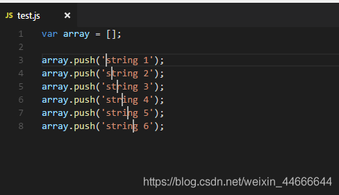
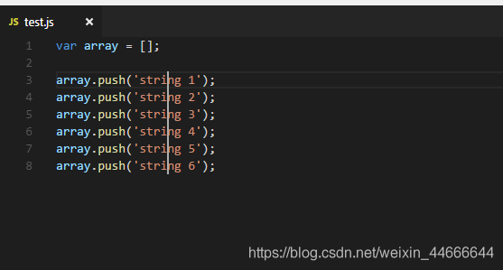
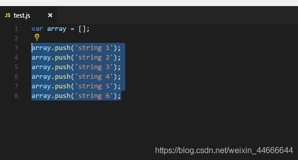
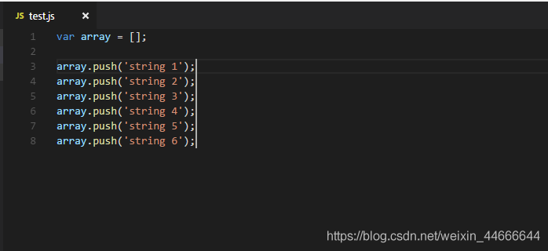
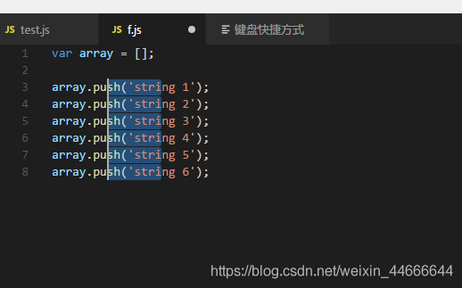

## 多光标同时编辑
[vscode同时编辑多处的几种方法](https://blog.csdn.net/weixin_44666644/article/details/105673429)
1. 按住 alt ，用鼠标左键点击，可以出现多个光标，输入代码可以在光标处同时增加<br/>
<br/>
2. 按住Ctrl + Alt，再按键盘上向上或者向下的键，可以使一列上出现多个光标。<br/>
<br/>
3. 选中一段文字，按shift+alt+i，可以在每行末尾出现光标<br/>
<br/><br/>
<br/>
4. 按shift+alt，再使用鼠标拖动，也可以出现竖直的列光标，同时可以选中多列。<br/>


-----

## 快速创建html标签
+ E 代表HTML标签。
+ E#id 代表id属性。
+ E.class 代表class属性。
+ E[attr=foo] 代表某一个特定属性。
+ E{foo} 代表标签包含的内容是foo。
+ E>N 代表N是E的子元素。
+ E+N 代表N是E的同级元素。
```html
<!-- div#div1*3 -->
<div id="div1"></div>
<div id="div1"></div>
<div id="div1"></div>

<!-- div.divclass*2 -->
<div class="divclass"></div>
<div class="divclass"></div>

<!-- img[alt='altText']*2 -->


<!-- h2{这是标题} -->
<h2>这是标题</h2>

<!-- ul>li{这是列表}*3 -->
<ul>
    <li>这是列表</li>
    <li>这是列表</li>
    <li>这是列表</li>
</ul>

<!-- span+a+p -->
<span></span><a href=""></a>
<p></p>
```

